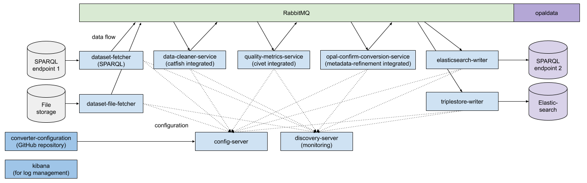

# OPAL converter

The converter refines metadata and transforms it into 5-Star Linked Open Data. This is a publish-subscribe microservice design project via Spring Cloud and Java. The deployment of the project is based on docker-compose. Scaling can be configured manually. 

The converter integrates the following OPAL components:

- [Catfish](https://github.com/projekt-opal/catfish) (data-cleaner-service)
- [Civet](https://github.com/projekt-opal/civet) (quality-metrics-service)
- [Metadata-Refinement](https://github.com/projekt-opal/metadata-refinement) (opal-confirm-conversion-service)




## How to use

To build the project you must create a .env file and specify the required environment variables. Afterwards, by running the run.sh file it will build and setup the project. 
The configuration also includes the [converter-configuration](https://github.com/projekt-opal/converter-configuration) repository.
For details, take a look into the [wiki](https://github.com/projekt-opal/converter/wiki).

```
# Triplestore to read data
CRAWLER_TRIPLESTORE_URL=
CRAWLER_TRIPLESTORE_USERNAME=
CRAWLER_TRIPLESTORE_PASSWORD=

# Triplestore to write data
OPAL_TRIPLESTORE_URL=
OPAL_TRIPLESTORE_USERNAME=admin
OPAL_TRIPLESTORE_PASSWORD=

# Free to choose
RABBITMQ_USERNAME=
RABBITMQ_PASSWORD=
H2_DB_PASSWORD=

# Elasticsearch configuration for logging
ELASTICSEARCH_JAVA_OPTS=-Xms512m -Xmx512m
```

## Credits

[Data Science Group (DICE)](https://dice-research.org/) at [Paderborn University](https://www.uni-paderborn.de/)

This work has been supported by the German Federal Ministry of Transport and Digital Infrastructure (BMVI) in the project [Open Data Portal Germany (OPAL)](http://projekt-opal.de/) (funding code 19F2028A).

